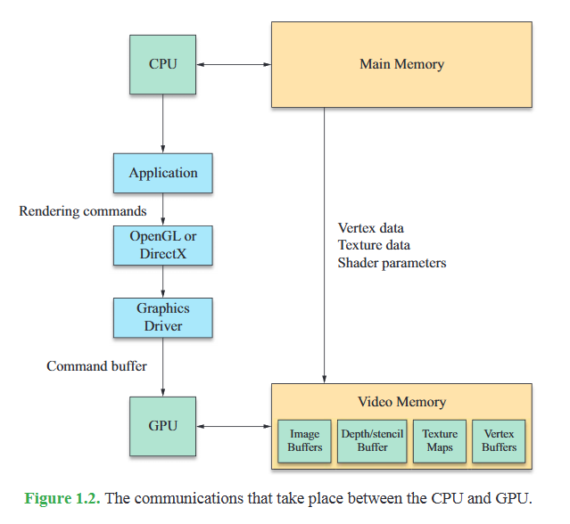

# Math for 3D Programming

## Rendering Pipeline

The geometrical forms of 3D objects are each represented by a set of vertices and a particular type of *graphics primitive* that indicates how the vertices  are  connected  to  produce a  shape. (pp. 1)

An application communicates with the GPU by sending commands to a rendering  library,  such  as  OpenGL,  which  in  turn  sends  commands  to  a  driver  that  knows how to speak to the GPU in its native language. The interface to OpenGL is called a Hardware Abstraction Layer (HAL) (pp. 2)

VRAM contains at least a single render buffer, and optionally:

- Back + front buffer
- Z/depth buffer
- Stencil buffer
- 0+ texture maps (color, normal maps, etc.)